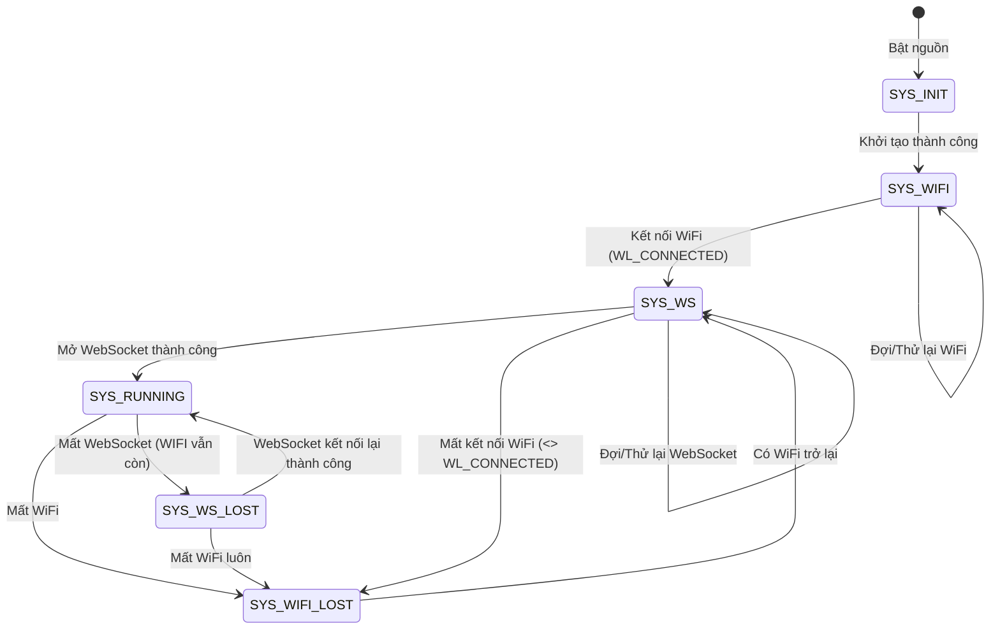
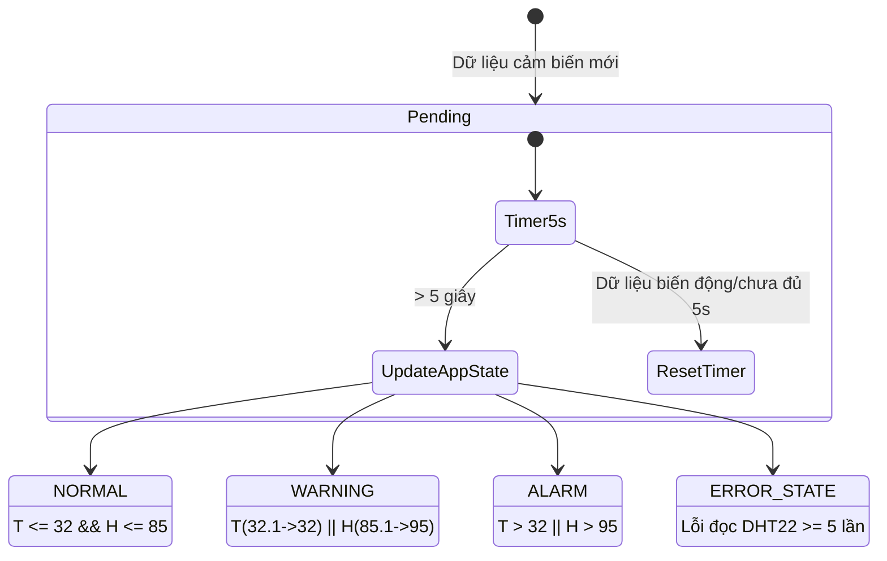
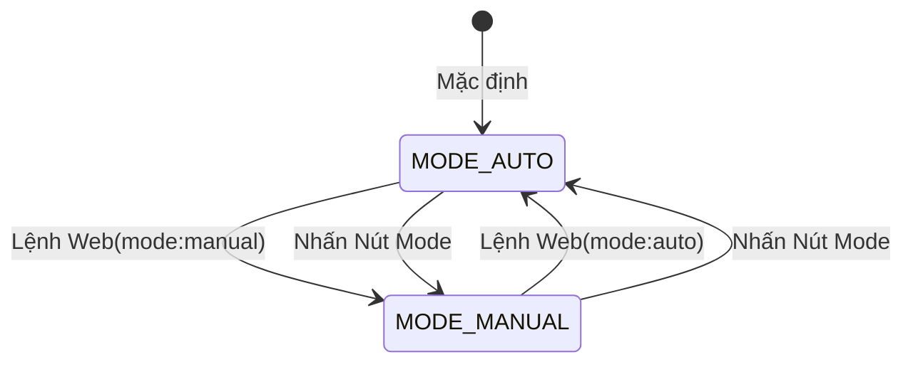
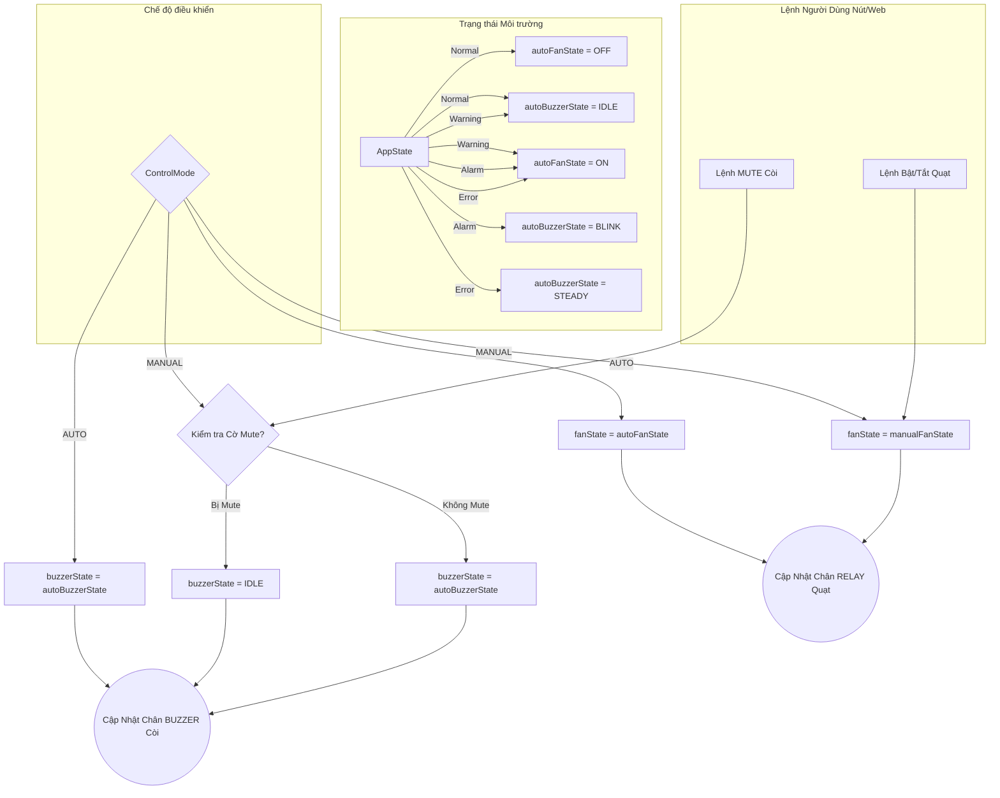

# Sơ đồ máy trạng thái (State Machine Diagrams)

Dưới đây là các sơ đồ máy trạng thái cho hệ thống của bạn. Bằng cách tách thành các cụm riêng biệt, bạn sẽ dễ dàng giải thích luật logic cho người khác hơn rất nhiều.

## 1. SystemState - Vòng đời kết nối hệ thống
Đây là sơ đồ lớn nhất, quản lý sinh mệnh kết nối của bo mạch. Nó chạy theo tính chất "tuần tự" (cái này có rồi mới làm tới cái kia) và "tự phục hồi" (rớt lúc nào thì quay lại chờ lúc đó).

---

## 2. AppState - Trạng thái môi trường (Theo cảm biến)
Trạng thái này được tính toán hoàn toàn độc lập dựa trên điều kiện môi trường. Tuy nhiên, nó có một **cơ chế trễ (delay confirmation)** với khoảng thời gian `APP_STATE_CONFIRM_MS = 5000ms` để chống nhiễu cảm biến tạm thời. Nghĩa là giá trị mới phải duy trì đủ 5 giây mới được công nhận.

---

## 3. ControlMode - Chế độ điều khiển

Đây là cái "Van" chuyển mạch cho phép Nút Bấm Vật Lý/Web tác động vào Fan và Buzzer.

---

## 4. Quạt & Còi (Sự phân tách giữa Auto và Manual)

Biểu đồ này mô tả cách Fan và Buzzer quyết định sẽ nghe lời ai (nghe lời AppState hay nghe lời người dùng) thông qua cái "Van" ControlMode.

